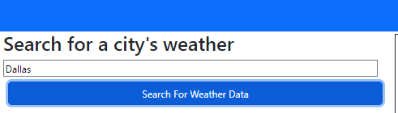

# StormCentral

## Description

This is a "simple" weather application that allows a user to input a city name and obtain current weather information as well as a 5 day forecast for that city.

## Installation

There is no installation needed in order to utilize this application. Simply visit the website at the following link:
https://jonahkane.github.io/StormCentral/

## Usage

To use this application, the user will visit the page and be with weather data for the city of Minneapolis by default.

They will be able to enter a city name in the search field and either click on the "search for weather data" button OR simply hit enter on their keyboard.

When they invoke the search, the user will be presented with the current forecast for the city that they chose. They will see the city Name, "today's" date, an icon depicting current weather conditions, a short description of what that icon means, current temperature, current humidity, and the current wind speed. This will all be displayed in the top main section of the page.

Below that, The user will be presented with a 5 day forecast for that same city where they will see the date, that weather icon, a description of what that icon means, the high temperature for the day, the humidity level and the wind speed.

On the left hand side of the page under the search bar, the user will see a list of all of the cities that they have previously searched for and the will have the opportunity to click on a city within that list to review the data again.

## Credits

The code was authored by me. But I had A LOT of help from various sources including multiple tutoring sessions, multiple brainstorming sessions with TA's, I used other students as recources for various parts of my code as well as countless hours of google searches and youtube tutorials.

## License

MIT license. Please refer to the LICENSE in the repo if applicable.
